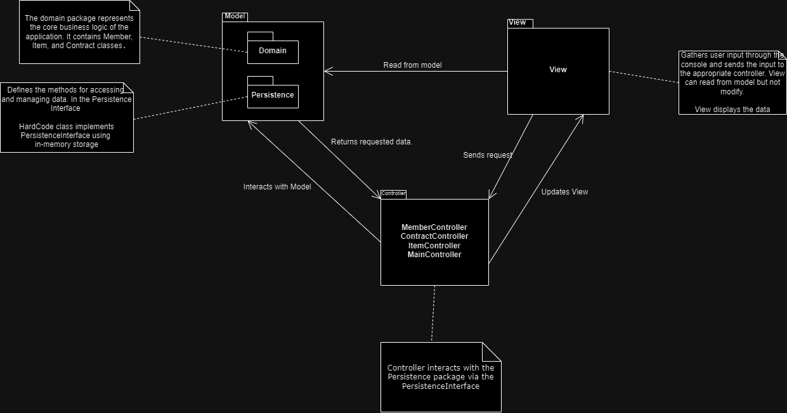

# A2
Members : Emil, Sofie, Eva

This project is for Assignment 2, focusing on building a Stuff Lending System using a model-view-controller (MVC) architecture. The system allows users to manage members, items, contracts, and time-related actions through a console-based interface. The project is implemented in Java, using Gradle for build.

## Instructions
The project has a main menu and two sub menus, one for Item and one for Member related actions. 

### Adding a Member
1. Select option `1` from the main menu, followed by option 1 in the sub member menu..
2. Follow the prompts to enter the member's name, email, and phone number.
3. The member will be added to the system.

### Adding an Item
1. Select option `1` from the main menu. Then option 2 in the sub menu and once you have selected the member you can add an item, update, delete member or one of their items.
2. Follow the prompts to enter the item's name, description, category, and cost per day.
3. The item will be added to the system and associated with the member.

### View Item and subsequent contracts
1. Select option `2` from the main menu. Then select 1 and enter item number.
2. From here you can view the items vcontracts, more information about the item, update and delete the item.
3. The system will display a list of all items.

### Listing Members
1. Select option `1` from the main menu. Then select option 3 for a simple list of members or option 4 for a verbose list of members.
2. The system will display a list of all members.

### Advancing Time
1. Select option `3` from the main menu.
2. Follow the prompts to enter the number of days to advance.
3. The system will update the borrowing durations accordingly.

### Exiting the Application
1. Select option `0` from the main menu and enter days to advance.
2. The application will terminate.

## Design
 contains the prescribed architectural design of the application. For more information see design.md

## Project Overview

The Stuff Lending System allows users to:

Add and manage members.
Add and manage items.
Borrow items through contracts.
Advance time within the system to handle borrowing durations.

The system is structured into the following packages:

controller: Handles the logic for managing members, items, contracts, and time progression.
model.domain: Contains classes for the domain entities, such as Member and Item. 
model.persistance contains the persistance interface amd hard coded data.
view: Manages the console-based user interface and user interactions.

## Building
The build must pass by running console command:  
`./gradlew build`  
Note that you should get a report over the quality like:
```
CodeQualityTests > codeQuality() STANDARD_OUT
    0 CheckStyle Issues in controller/App.java
    0 CheckStyle Issues in controller/Simple.java
    0 CheckStyle Issues in model/Simple.java
    0 CheckStyle Issues in view/Simple.java
    0 FindBugs Issues in controller/App.java
    0 FindBugs Issues in model/Simple.java
    0 FindBugs Issues in view/Simple.java
    0 FindBugs Issues in controller/Simple.java
```

Removing or manipulating the code quality checks results in an immediate assignment **Fail**. 

## Running
The application starts by running console command:  
`./gradlew run -q --console=plain`

## Versioning
Adheres to the git versioning instructions according to the assignment.

## System test
Test rapport can be found in the testreport.md file.
