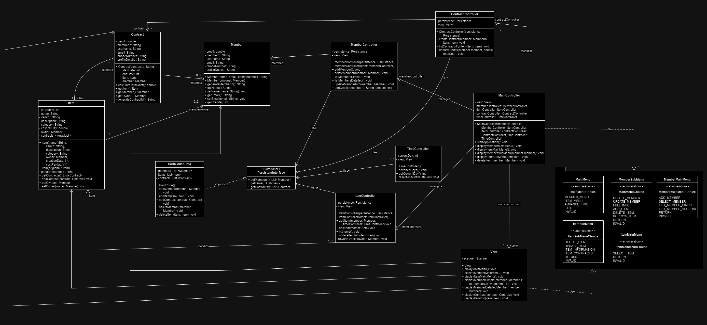

# Lending System OO-Design
This document describes the design according to the requirements presented in assignment 2.

## Architectural Design

The architectural design follows an MVC pattern:

Model: Represents the data and business logic (e.g., Member, Item, Contract).
View: Manages user input/output through the console. Can read from model but not modify
Controller: Acts as an intermediary between the view and the model, processing user actions and updating the view as needed.

## Detailed Design

### Class Diagram

The above class diagram indicates the classes in our system and their relationships. The Member, Item, and Contract classes interact with each other and their respective controllers. The MainController manages the MemberController, TimeController, ItemController, and ContractController. The view and Main controller interact. The view class also reads from the item, member and contract classes.

## Class Diagram with packages

THe class diagram has three main packages, model, view, and controller. The model package has two subpackages, domain and persistence. Domain package contains the item, contract and member classes and the persistence subpackage contains the persistence interface and the hardcoded class. The view has a relationship with the domain subpackage as it can read from the classes within this sub package. 

### Sequence Diagram

The sequence diagram corresponds to the addition of a third member to the system in which two other members  exist. MainController and MemberController from the controller package. View from the view package, and member and persistence from the model package. Memebr from the domain sub pacakge and persistence from the persistence sub package.

### Object Diagram

The object diagram corresponds to the sequence diagram scenario in which a new member is added to the system that contains two members.